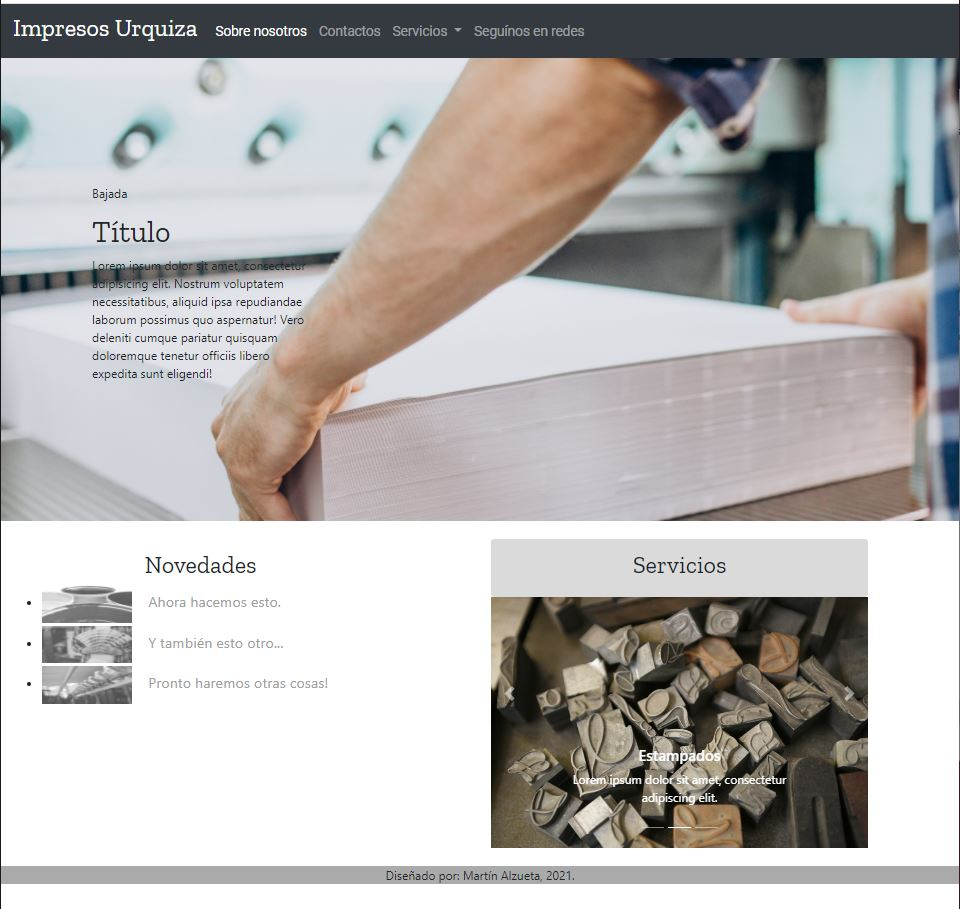

# SitioImprentaNode

Final project for the UTN's Initial Web Development course carried out between May and September 2021. It is a comprehensive website, structured with Node.js using the Express framework. The site is integrated with a database and a mail server. The design is based on the Bootstrap library. 

